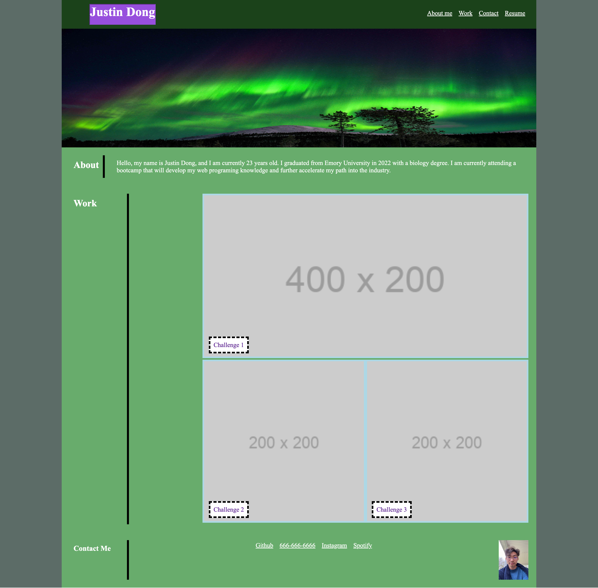

# personal-portfolio-html-css

## Description 

This website is a mock portfolio developed by Justin Dong that only utilizes HTML and CSS. No javascript was used during this proces. The mock portfolio is displayed to represent the knowledge of css and html that I have learned thus far. This project is currently in development and will not be used in real life career hunting situations. 

## Badges

NA

## Visuals

## Installation

NA 
## Usage

Provides an interactive portfolio displaying small info about the author (Justin Dong) along with their work and method of contact. The resume tab is currently unresponsive as it is not yet linked to it.

## Roadmap

Implementation of javascript to link other webs via POST or GET.

## Contributing

Not currently open to contributions at this time.

## Authors and acknowledgement

Justin Dong
## License

NA

## Resources

[Github Repository](https://github.com/dong135790/personal-portfolio-html-css)
[Deployed Site](https://dong135790.github.io/personal-portfolio-html-css/)

## Project Status
